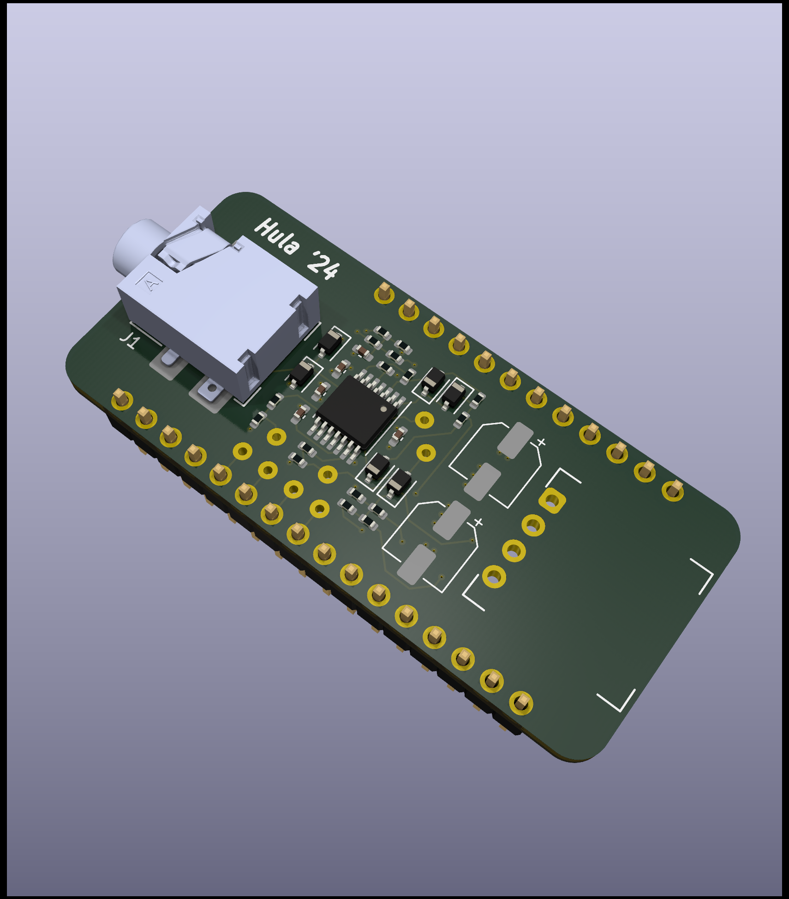

Piezo Preamp FeatherWing
=========================================

### By Carsten Thue-Bludworth, September 2024

This featherwing provides a high-impedance gain stage and a simple envelope follower for piezo contact microphones.

The piezo is connected via a standard 3.5mm TRS shielded audio connector with the following pinout:
 - Tip: piezo signal
 - Ring: piezo ground
 - Sleeve: cable shield (not connected on piezo end)

The board requires a bipolar +12V/-12V power supply, provided via a 4pos Molex SL connector with the following pinout:
 - 1: +12V
 - 2: GND
 - 3: -12V
 - 4: signal out (default to unattenuated envelope follower signal).

Jumpers and plated holes are provided to configure which signals are sent to which pins.
* By default, the SL connector gets the unattenuated envelope follower signal.
* By default, no analog pins on the feather headers are connected. Use wire jumpers to connect signals to the analog pins you want to use.
* Jumpers can configure the amplifier stage gain, as well as the envelope follower decay time. By default, the gain is 100x and the decay is set with a 270k resistor.